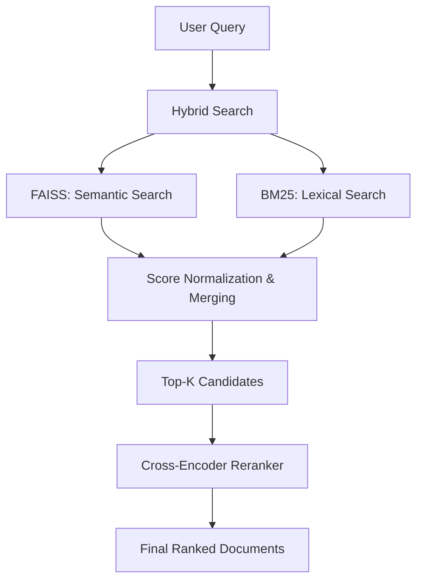

# RAG Retrieval & Indexing API

A high-performance standalone service for document indexing and hybrid retrieval. This API is designed to be the retrieval backbone for RAG (Retrieval-Augmented Generation) pipelines, focusing strictly on finding the most relevant context without generation overhead.

## 🏗️ Architecture

The system uses a **Hybrid Retrieval** strategy followed by a **Cross-Encoder Reranker** to achieve state-of-the-art accuracy.



### Components
1.  **Semantic Search (FAISS)**: Uses `sentence-transformers/all-MiniLM-L6-v2` to understand the meaning of the query.
2.  **Lexical Search (BM25)**: Uses the `rank-bm25` algorithm to match exact keywords and terminology.
3.  **Hybrid Merging**: Combines scores from both methods using configurable weights (default: 70% Semantic, 30% Lexical).
4.  **Reranking**: Uses `cross-encoder/ms-marco-MiniLM-L-6-v2` to perform a deep semantic comparison between the query and the top candidates.

---

## 🚀 Quick Start

### Prerequisites
- Python 3.12+
- [uv](https://docs.astral.sh/uv/) (recommended for dependency management)

### Installation
1. Clone the repository and navigate to the folder.
2. Install dependencies:
   ```bash
   uv sync
   ```
3. Create a `.env` file with your Hugging Face token:
   ```env
   HF_TOKEN=your_huggingface_token
   ```

### Running the API
```bash
uv run uvicorn main:app --host 0.0.0.0 --port 8000
```

---

## 🛠️ API Usage

### 1. Index Documents
Store your knowledge base.
- **Endpoint**: `POST /index`
- **Body**:
  ```json
  {
    "documents": [
      {"page_content": "Your text here", "metadata": {"source": "manual"}}
    ],
    "rebuild_cache": false
  }
  ```

### 2. Retrieve Context
Search for the most relevant documents.
- **Endpoint**: `POST /retrieve`
- **Body**:
  ```json
  {
    "query": "How do I setup the API?",
    "top_k": 3,
    "enable_rerank": true
  }
  ```

---

## 🐳 Docker Deployment

The service is fully containerized using `uv` for minimal image size and fast startup.

### Build Image
```bash
docker build -t retrieval-api .
```

### Run Container
```bash
docker run -p 8000:8000 --env-file .env retrieval-api
```

---

## 🧪 Testing

A test script is provided to verify the full flow:
```bash
uv run python test_api.py
```
This script indexes sample data and runs a retrieval query to confirm the hybrid system is functioning correctly.
