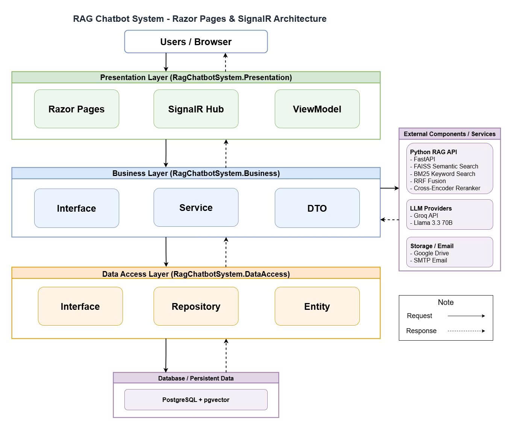

# 🤖 RAG Chatbot System

[](https://dotnet.microsoft.com/download/dotnet/9.0)
[](https://www.python.org/)
[](https://fastapi.tiangolo.com/)
[](https://www.postgresql.org/)
[](https://learn.microsoft.com/en-us/aspnet/core/signalr/introduction)
[](https://www.docker.com/)

Hệ thống Chatbot hỏi đáp thông minh dựa trên tri thức tùy chỉnh sử dụng kỹ thuật **RAG (Retrieval-Augmented Generation)**. Dự án kết hợp hiệu năng xử lý nghiệp vụ của **ASP.NET Core (.NET 9) Razor Pages** với sức mạnh xử lý học máy (Embedding, Hybrid Search, Reranking) bằng **Python FastAPI** và truyền tải dữ liệu thời gian thực thông qua **SignalR WebSockets**.

---

## 📋 Mục lục

1. [Tổng quan kiến trúc](#1-tổng-quan-kiến-trúc)
2. [Cấu trúc thư mục dự án](#2-cấu-trúc-thư-mục-dự-án)
3. [Các tính năng nổi bật](#3-các-tính-năng-nổi-bật)
4. [Yêu cầu hệ thống](#4-yêu-cầu-hệ-thống)
5. [Hướng dẫn cấu hình môi trường](#5-hướng-dẫn-cấu-hình-môi-trường)
6. [Hướng dẫn khởi chạy dự án](#6-hướng-dẫn-khởi-chạy-dự-án)
7. [Chạy Kiểm thử (Automated Tests)](#7-chạy-kiểm-thử-automated-tests)
8. [Lưu ý quan trọng & Khắc phục sự cố](#8-lưu-ý-quan-trọng--khắc-phục-sự-cố)

---

## 1. Tổng quan kiến trúc

Dự án được xây dựng theo **Kiến trúc 3 lớp (3-Layer Architecture)** kết hợp với một dịch vụ phụ trợ **Python (FastAPI)** đóng vai trò là "Retrieval Backbone" để xử lý các mô hình học máy và lưu trữ chỉ mục vector tìm kiếm lai.

### Sơ đồ kiến trúc (Conceptual Diagram)
Dưới đây là sơ đồ chi tiết tích hợp luồng thời gian thực **SignalR** giữa các tầng hệ thống:



---

## 2. Cấu trúc thư mục dự án

```
RAG-Chatbot-System/
├── RAG-Retrieval-Indexing-API/    # Dịch vụ Python FastAPI (Embedding, FAISS/BM25, Reranking)
├── RagChatbotSystem.DataAccess/   # Tầng dữ liệu .NET (EF Core, Repositories, AppDbContext, pgvector)
├── RagChatbotSystem.Business/     # Tầng nghiệp vụ .NET (Dịch vụ RAG, Trích xuất tài liệu, Tương tác LLMs)
├── RagChatbotSystem.Presentation/ # Tầng trình diễn .NET (Razor Pages, SignalR Hubs, API Controllers)
├── RagChatbotSystem.Tests/        # Bộ kiểm thử tự động .NET (Document processing & Chunking algorithms)
├── docs/                          # Sơ đồ & Tài liệu chi tiết thiết kế hệ thống
├── docker-compose.yml             # File cấu hình Docker Compose triển khai toàn bộ hệ thống
├── nginx.conf                     # File cấu hình Nginx Reverse Proxy hỗ trợ WebSockets cho SignalR
└── setup_vps.sh                   # Script bash thiết lập môi trường nhanh trên máy chủ VPS
```

---

## 3. Các tính năng nổi bật

*   ⚡ **Truyền tải thời gian thực (Realtime SignalR Hubs)**:
    *   **AI Streaming**: Trả kết quả từng từ một từ LLM thông qua SignalR (`/hubs/chat`), giảm thiểu thời gian chờ của người dùng.
    *   **Document Progress Tracker**: Hiển thị trạng thái xử lý tài liệu từng bước thời gian thực qua (`/hubs/document`) (Đang tải lên -> Đang trích xuất văn bản -> Đang tạo vector -> Đang lập chỉ mục -> Hoàn thành).
    *   **Auto-sync UI**: Tự động cập nhật danh sách phòng chat, trạng thái duyệt tài khoản người dùng mà không cần tải lại trang thông qua (`/hubs/notifications`).
*   🗂️ **Hỗ trợ đa định dạng tài liệu**: Tự động phân tách và trích xuất nội dung từ các file `.txt`, `.pdf` (sử dụng *PdfPig*), và `.docx` (sử dụng *OpenXml*).
*   🔑 **Quản trị người dùng & Phân quyền chặt chẽ (Admin Provisioned)**:
    *   *Tự đăng ký công khai (Public Registration)* đã được vô hiệu hóa. Tài khoản chỉ được cấp phát bởi quản trị viên.
    *   **Import học sinh từ Excel**: Admin có thể import hàng loạt tài khoản Học sinh (Student) bằng tệp Excel `.xlsx`. Mật khẩu tạm thời sẽ được tạo ngẫu nhiên và gửi trực tiếp qua email của học sinh.
    *   **Khởi tạo giáo viên**: Admin tạo trực tiếp tài khoản Giáo viên (Teacher) và phân công phụ trách các Dataset chuyên môn.
    *   *Đổi mật khẩu bắt buộc*: Người dùng đăng nhập bằng mật khẩu tạm thời lần đầu sẽ bị buộc chuyển hướng sang trang đổi mật khẩu mới.
*   🧩 **Thuật toán phân mảnh thông minh (Smart Chunking)**:
    *   Chia nhỏ tài liệu thành các đoạn `600` ký tự, trùng lặp (overlap) `120` ký tự.
    *   Thuật toán `ResolveDominantPage` xác định trang xuất xứ chính xác nhất của từng chunk khi văn bản bị nằm chồng lấn giữa các trang.
*   🤖 **Hỗ trợ đa LLM & Cơ chế dự phòng (Fallback)**:
    *   Tích hợp linh hoạt các nhà cung cấp **Gemini (Gemini 2.0 Flash)**, **Groq (Llama 3.3)** và **OpenAI (GPT-4o-mini)**.
    *   *Cơ chế Fallback*: Nếu LLM chính gặp sự cố kết nối hoặc hết hạn hạn mức (Rate Limit), hệ thống tự động trích xuất các câu trích dẫn thô từ ngữ cảnh tìm thấy trong PostgreSQL để hiển thị trực tiếp cho người dùng, đảm bảo dịch vụ không bị gián đoạn.
*   📌 **Trích dẫn nguồn dẫn chứng (Citations)**: Câu trả lời của AI đi kèm liên kết chi tiết nội dung đoạn trích dẫn, tên file gốc và số trang cụ thể giúp người dùng dễ dàng đối chiếu.

---

## 4. Yêu cầu hệ thống

Trước khi bắt đầu, hãy đảm bảo máy tính của bạn đã cài đặt các công cụ sau:
*   **.NET 9 SDK**
*   **Python 3.12+** (Sử dụng [uv](https://docs.astral.sh/uv/) để quản lý dependencies nhanh nhất)
*   **Docker Desktop** (Để chạy PostgreSQL hỗ trợ `pgvector` hoặc chạy toàn bộ dự án qua Docker Compose)
*   **SMTP Server** (Để gửi email tạo tài khoản, ví dụ: tài khoản Gmail đã bật mật khẩu ứng dụng)

---

## 5. Hướng dẫn cấu hình môi trường

### 5.1. Cấu hình tệp tin môi trường (`.env`)
Tạo file `.env` ở thư mục gốc của dự án dựa trên file `.env.example`:

```bash
# === Database ===
DB_PASSWORD=your_secure_password

# === LLM API Keys (Cấu hình ít nhất 1 nhà cung cấp) ===
GROQ_API_KEY=your_groq_api_key
GEMINI_API_KEY=your_gemini_api_key
OPENAI_API_KEY=your_openai_api_key

# === HuggingFace Token (Không bắt buộc) ===
HF_TOKEN=

# === Google Drive Storage (Không bắt buộc, dùng để đồng bộ file) ===
GOOGLE_DRIVE_FOLDER_ID=your_gdrive_folder_id

# === Seed Admin Account (Tự động khởi tạo khi chạy lần đầu) ===
ADMIN_EMAIL=admin@system.com
ADMIN_PASSWORD=YourAdminPassword123!
```

### 5.2. Cấu hình ứng dụng Web (`appsettings.json`)
Do `appsettings.json` chứa các thông tin nhạy cảm nên đã được đưa vào `.gitignore`. Bạn hãy tạo file `appsettings.json` trong thư mục [RagChatbotSystem.Presentation](RagChatbotSystem.Presentation) theo mẫu sau:

```json
{
  "Logging": {
    "LogLevel": {
      "Default": "Information",
      "Microsoft.AspNetCore": "Warning"
    }
  },
  "AllowedHosts": "*",
  "ConnectionStrings": {
    "DefaultConnection": "Host=localhost;Port=5432;Database=RagChatbotSystemDb;Username=postgres;Password=your_secure_password"
  },
  "RagApi": {
    "BaseUrl": "http://localhost:8000"
  },
  "Groq": {
    "ApiKey": "YOUR_GROQ_KEY_HERE",
    "Model": "llama-3.3-70b-versatile"
  },
  "OpenAi": {
    "ApiKey": "YOUR_OPENAI_KEY_HERE",
    "Model": "gpt-4o-mini"
  },
  "Gemini": {
    "ApiKey": "YOUR_GEMINI_KEY_HERE"
  },
  "Smtp": {
    "Host": "smtp.gmail.com",
    "Port": "587",
    "Username": "your_email@gmail.com",
    "Password": "your_app_password",
    "FromEmail": "your_email@gmail.com",
    "FromName": "RAG Chatbot System Admin"
  },
  "GoogleDrive": {
    "CredentialJsonPath": "google-credentials.json",
    "TargetFolderId": "YOUR_GOOGLE_DRIVE_FOLDER_ID"
  }
}
```

> [!NOTE]
> Nếu bạn không cấu hình Google Drive (`CredentialJsonPath` trống hoặc file không tồn tại), hệ thống sẽ tự động chuyển hướng lưu trữ tài liệu cục bộ tại thư mục `wwwroot/uploads` (Local Storage Fallback).

---

## 6. Hướng dẫn khởi chạy dự án

### Cách 1: Khởi chạy nhanh bằng Docker Compose (Khuyên dùng)
Cách này tự động dựng các Docker images, thiết lập mạng nội bộ, khởi tạo cơ sở dữ liệu PostgreSQL + `pgvector`, chạy RAG API (Python) và C# Web App.

1. Tạo file `.env` ở thư mục gốc như hướng dẫn ở mục 5.1.
2. Đặt tệp thông tin Google Drive `google-credentials.json` (nếu có) vào thư mục gốc của dự án.
3. Mở Terminal tại thư mục gốc và chạy:
   ```bash
   docker-compose up --build -d
   ```
4. Truy cập các dịch vụ tại địa chỉ:
   *   **Web App (Razor Pages)**: `http://localhost:5259`
   *   **Python RAG API (Interactive Docs)**: `http://localhost:8000/docs`
   *   **PostgreSQL**: `localhost:5432`

---

### Cách 2: Khởi chạy thủ công (Phát triển cục bộ)

#### Bước 1: Khởi chạy PostgreSQL hỗ trợ pgvector
Sử dụng Docker để khởi động container DB chứa extension vector:
```bash
docker run --name rag-postgres-db -e POSTGRES_PASSWORD=your_secure_password -e POSTGRES_DB=RagChatbotSystemDb -p 5432:5432 -d ankane/pgvector:latest
```

#### Bước 2: Áp dụng Migrations dữ liệu cho database
Đảm bảo bạn đã cài đặt công cụ `dotnet-ef`. Chạy lệnh migrations từ thư mục gốc của dự án:
```bash
dotnet ef database update --project RagChatbotSystem.DataAccess --startup-project RagChatbotSystem.Presentation
```

#### Bước 3: Khởi chạy Python RAG API
1. Di chuyển vào thư mục Python API:
   ```bash
   cd RAG-Retrieval-Indexing-API
   ```
2. Cài đặt các dependencies:
   *   *Sử dụng `uv` (Khuyên dùng - Cực kỳ nhanh)*:
       ```bash
       uv sync
       ```
   *   *Sử dụng `pip` truyền thống*:
       ```bash
       pip install .
       ```
3. Khởi chạy service RAG:
   *   *Bằng `uv`*:
       ```bash
       uv run uvicorn main:app --host 127.0.0.1 --port 8000 --reload
       ```
   *   *Bằng `uvicorn` thông thường*:
       ```bash
       uvicorn main:app --host 127.0.0.1 --port 8000 --reload
       ```

#### Bước 4: Khởi chạy ASP.NET Core Presentation Layer
1. Quay lại thư mục gốc của dự án.
2. Khởi chạy ứng dụng C# Razor Pages:
   ```bash
   dotnet run --project RagChatbotSystem.Presentation/RagChatbotSystem.Presentation.csproj --launch-profile http
   ```
3. Mở trình duyệt và truy cập: `http://localhost:5259`

---

## 7. Chạy Kiểm thử (Automated Tests)

Dự án đi kèm bộ test tự động sử dụng xUnit để xác thực các giải thuật trích xuất, phân mảnh tài liệu và thuật toán resolve số trang:

*   **Chạy toàn bộ kiểm thử .NET**:
    ```bash
    dotnet test RagChatbotSystem.sln
    ```
*   **Chạy kiểm thử luồng RAG API (Python)**:
    ```bash
    cd RAG-Retrieval-Indexing-API
    uv run python test_api.py
    ```

---

## 8. Lưu ý quan trọng & Khắc phục sự cố

> [!TIP]
> **Kích hoạt Extension Vector trong PostgreSQL**:
> Nếu tự cài đặt PostgreSQL cục bộ mà không sử dụng Docker image `ankane/pgvector`, bạn bắt buộc phải cài đặt extension này trên máy chủ và chạy câu lệnh SQL sau trước khi áp dụng migrations:
> ```sql
> CREATE EXTENSION IF NOT EXISTS vector;
> ```

> [!WARNING]
> **Xóa Cache của RAG API**:
> Python API lưu bộ nhớ đệm chỉ mục tìm kiếm FAISS & BM25 tại thư mục `cache/`. Khi muốn làm sạch dữ liệu để lập chỉ mục lại hoàn toàn, hãy xóa thư mục này trước khi chạy lại service Python.

> [!IMPORTANT]
> **Vấn đề kết nối SignalR WebSockets qua Nginx**:
> Khi triển khai qua Nginx, kết nối WebSocket có thể bị lỗi hoặc tự động hạ cấp xuống Long Polling nếu các headers Upgrade không được cấu hình chính xác. Hãy tham khảo mẫu cấu hình tại [nginx.conf](nginx.conf). Để đảm bảo kết nối hoạt động ổn định, bạn nên thay đổi dòng `proxy_set_header Connection keep-alive;` trong Nginx cấu hình thực tế thành `proxy_set_header Connection $http_connection;`.
