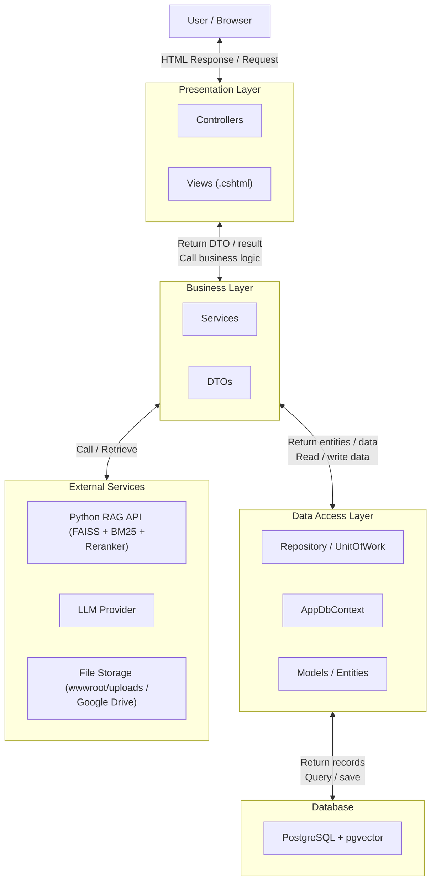

# 🤖 RAG Chatbot System

Hệ thống Chatbot hỏi đáp thông minh dựa trên tri thức tùy chỉnh sử dụng kỹ thuật **RAG (Retrieval-Augmented Generation)**. Dự án kết hợp hiệu năng xử lý hệ thống của **ASP.NET Core (.NET 9)** và sức mạnh của các mô hình Học máy (Embedding, Hybrid Search, Reranking) bằng **Python FastAPI**.

---

## 📋 Mục lục
1. [Tổng quan kiến trúc](#-tổng-quan-kiến-trúc)
2. [Các tính năng nổi bật](#-các-tính-năng-nổi-bật)
3. [Công nghệ sử dụng](#-công-nghệ-sử-dụng)
4. [Yêu cầu hệ thống](#-yêu-cầu-hệ-thống)
5. [Cấu hình môi trường](#-cấu-hình-môi-trường)
6. [Hướng dẫn khởi chạy dự án](#-hướng-dẫn-khởi-chạy-dự-án)
7. [Luồng nghiệp vụ chính & API Contract](#-luồng-nghiệp-vụ-chính--api-contract)
8. [Chạy Automated Tests](#-chạy-automated-tests)

---

## 🏗️ Tổng quan kiến trúc

Dự án được xây dựng theo mô hình kiến trúc phân tầng kết hợp dịch vụ ngoài.

### Sơ đồ kiến trúc (Hình ảnh)


*(Bạn có thể lưu ảnh kiến trúc của mình vào thư mục `docs/architecture.png` để hiển thị trực tiếp tại đây)*

### Sơ đồ luồng hoạt động các lớp



---

## 🌟 Các tính năng nổi bật

-   **Upload & Xử lý tài liệu riêng biệt**: Quy trình tải lên và lập chỉ mục (indexing) được tách thành 2 bước giúp tối ưu trải nghiệm người dùng trên frontend.
-   **Đa định dạng tài liệu**: Hỗ trợ trích xuất văn bản tự động từ các tệp tin `.txt`, `.pdf` (sử dụng *PdfPig*), và `.docx` (sử dụng *OpenXml*).
-   **Phân mảnh thông minh (Smart Chunking)**: Cắt văn bản thành các chunk kích thước `600` ký tự với độ trùng lặp (overlap) `120` ký tự nhằm giữ trọn vẹn ngữ cảnh. Khi chunk trải dài qua nhiều trang PDF, số trang của chunk sẽ được tính dựa trên thuật toán `ResolveDominantPage`.
-   **Tìm kiếm lai (Hybrid Search) nâng cao**: Kết hợp sức mạnh của:
    -   *Lexical Search (BM25)*: Khớp từ khóa chính xác.
    -   *Semantic Search (FAISS)*: Hiểu ngữ nghĩa của câu hỏi.
    -   *Reciprocal Rank Fusion (RRF)*: Thuật toán hợp nhất điểm số hai chỉ mục.
    -   *Cross-Encoder Reranker*: Mô hình tính tương quan ngữ cảnh để sắp xếp lại các kết quả tối ưu nhất trước khi gửi tới LLM.
-   **Hỗ trợ đa LLM & Cơ chế dự phòng (Fallback)**: Tích hợp với **Gemini**, **Groq (Llama 3.3)** và **OpenAI**. Nếu dịch vụ LLM chính bị lỗi hoặc thiếu API key, hệ thống sẽ tự động kích hoạt cơ chế fallback để không làm gián đoạn trải nghiệm người dùng.
-   **Trích dẫn nguồn dẫn chứng (Citations)**: Câu trả lời của AI luôn đi kèm danh sách dẫn chứng hiển thị chi tiết nội dung đoạn trích, tên file gốc và số trang chính xác của tài liệu để người dùng dễ dàng kiểm chứng thông tin.

---

## 🛠️ Công nghệ sử dụng

-   **C# / .NET 9**: ASP.NET Core Web API, Entity Framework Core, PdfPig, OpenXml.
-   **Python 3.10+**: FastAPI, FAISS, Rank-BM25, Sentence-Transformers (all-MiniLM-L6-v2, Cross-Encoder).
-   **Database**: PostgreSQL hỗ trợ phần mở rộng `pgvector` để tìm kiếm vector tốc độ cao.
-   **Reverse Proxy**: Nginx.
-   **DevOps**: Docker, Docker Compose, GitHub Workflows.

---

## 🖥️ Yêu cầu hệ thống

Trước khi bắt đầu, hãy đảm bảo máy tính của bạn đã cài đặt các công cụ sau:
-   [.NET 9 SDK](https://dotnet.microsoft.com/en-us/download/dotnet/9.0)
-   [Python 3.10+](https://www.python.org/downloads/)
-   [Docker Desktop](https://www.docker.com/products/docker-desktop/) (Khuyên dùng để chạy nhanh Database + pgvector)
-   Công cụ quản lý cơ sở dữ liệu (ví dụ: pgAdmin hoặc DBeaver)

---

## ⚙️ Cấu hình môi trường

Tạo một file `.env` ở thư mục gốc của dự án dựa trên file `.env.example`:

```bash
# === Database ===
DB_PASSWORD=your_db_password

# === LLM API Keys (Cần cấu hình ít nhất 1 key) ===
GROQ_API_KEY=
GEMINI_API_KEY=
OPENAI_API_KEY=
# === HuggingFace Token (Không bắt buộc, dùng khi cần tải model giới hạn) ===
HF_TOKEN=

# === Google Drive Storage (Dùng để đồng bộ hoặc lưu file) ===
GOOGLE_DRIVE_FOLDER_ID=your_google_drive_folder_id
```

Cấu hình cho C# Web App ở file `RagChatbotSystem.Presentation/appsettings.json` (File này đã được `.gitignore` bỏ qua để bảo mật):

```json
{
  "ConnectionStrings": {
    "DefaultConnection": "Host=localhost;Port=5432;Database=RagChatbotSystemDb;Username=postgres;Password=your_db_password"
  },
  "RagApi": {
    "BaseUrl": "http://localhost:8000"
  },
  "Groq": {
    "ApiKey": "YOUR_GROQ_KEY_HERE",
    "Model": "llama-3.3-70b-versatile"
  }
}
```

---

## 🚀 Hướng dẫn khởi chạy dự án

### Cách 1: Khởi chạy nhanh toàn bộ dự án bằng Docker Compose (Khuyên dùng)

Cách này sẽ tự động build các image và kết nối các container bao gồm PostgreSQL (pgvector), FastAPI và C# Web App.

1.  Mở terminal tại thư mục gốc của dự án.
2.  Chạy câu lệnh:
    ```bash
    docker-compose up --build -d
    ```
3.  Hệ thống sẽ chạy tại các cổng:
    -   **Web App (C#)**: `http://localhost:5259`
    -   **FastAPI**: `http://localhost:8000`
    -   **PostgreSQL**: `localhost:5432`

---

### Cách 2: Khởi chạy thủ công các dịch vụ (Phát triển cục bộ)

#### Bước 1: Chạy PostgreSQL với pgvector
Sử dụng Docker để khởi chạy nhanh cơ sở dữ liệu có hỗ trợ pgvector:
```bash
docker run --name rag-postgres-db -e POSTGRES_PASSWORD=your_db_password -e POSTGRES_DB=RagChatbotSystemDb -p 5432:5432 -d pgvector/pgvector:pg16
```

#### Bước 2: Khởi tạo dữ liệu (Database Migrations)
Sử dụng công cụ EF Core để tạo và cập nhật các bảng cơ sở dữ liệu:
```bash
dotnet ef database update --project RagChatbotSystem.DataAccess --startup-project RagChatbotSystem.Presentation
```

#### Bước 3: Khởi chạy Python RAG API
1. Di chuyển vào thư mục Python:
   ```bash
   cd RAG-Retrieval-Indexing-API/RAG-Retrieval-Indexing-API
   ```
2. Cài đặt các thư viện cần thiết và chạy ứng dụng:
   ```bash
   pip install -r requirements.txt
   uvicorn main:app --host 127.0.0.1 --port 8000 --reload
   ```
3. Kiểm tra trạng thái của API bằng cách truy cập: `http://127.0.0.1:8000/docs`

#### Bước 4: Khởi chạy ứng dụng C# Web App
1. Quay lại thư mục gốc dự án.
2. Chạy lệnh khởi động:
   ```bash
   dotnet run --project RagChatbotSystem.Presentation/RagChatbotSystem.Presentation.csproj --launch-profile http
   ```
3. Truy cập vào ứng dụng tại địa chỉ: `http://localhost:5259`

---

## 🔄 Luồng nghiệp vụ chính & API Contract

Dưới đây là mô tả luồng gọi API thực tế giữa Client và Hệ thống:

### 1. Thiết lập không gian làm việc (Knowledge Base Setup)
-   **Tạo User**:
    *   `POST /api/users`
    *   Body: `{"fullName": "Nguyen Van A", "email": "a@example.com", "role": "User"}`
-   **Tạo Dataset**:
    *   `POST /api/datasets`
    *   Body: `{"name": "Tri Thức Dự Án A", "description": "Tài liệu đào tạo", "createdBy": "USER_ID"}`

### 2. Tải lên và xử lý tài liệu (Ingestion Flow)
-   **Bước A: Tải file lên hệ thống** (Trạng thái file sẽ là `Uploaded`):
    *   `POST /api/datasets/{datasetId}/documents`
    *   Form-data:
        -   `uploadedBy`: `USER_ID`
        -   `file`: Chọn file cần tải lên (PDF, DOCX, TXT)
-   **Bước B: Tiến hành phân mảnh và lập chỉ mục**:
    *   `POST /api/documents/{documentId}/process`
    *   *Mô tả*: C# sẽ trích xuất văn bản -> Gửi các chunk sang Python API `/index` để sinh vector -> Lưu dữ liệu chunk và vector vào PostgreSQL -> Chuyển trạng thái sang `Completed`.

### 3. Hỏi đáp cùng Chatbot (Query & Citation Flow)
-   **Tạo phiên Chat mới**:
    *   `POST /api/chat-sessions`
    *   Body: `{"userId": "USER_ID", "datasetId": "DATASET_ID", "title": "Hỏi đáp dự án"}`
-   **Gửi câu hỏi và nhận câu trả lời kèm dẫn chứng**:
    *   `POST /api/chat-sessions/{sessionId}/messages`
    *   Body: `{"question": "Quy trình xin nghỉ phép như thế nào?"}`
    *   **Response**: Trả về tin nhắn của người dùng, câu trả lời từ trợ lý AI và mảng `citations` (dẫn nguồn chi tiết bao gồm nội dung đoạn văn gốc, tên file và số trang cụ thể).

---

## 🧪 Chạy Automated Tests

Dự án đã xây dựng sẵn một bộ kiểm thử tự động tại thư mục `RagChatbotSystem.Tests` nhằm xác thực các thuật toán xử lý tài liệu, chunking và resolve số trang PDF.

Để chạy tests, bạn sử dụng lệnh:
```bash
dotnet test RagChatbotSystem.sln
```

---

> [!NOTE]
> - Python RAG API sử dụng bộ nhớ cache lưu tại `cache/faiss_index` và `cache/bm25.pkl`. Nếu muốn xóa chỉ mục để nạp lại từ đầu, hãy xóa thư mục `cache` này trước khi khởi chạy lại Python API.
> - Hãy chắc chắn rằng bạn đã kích hoạt extension `vector` trong PostgreSQL nếu cài đặt thủ công mà không dùng docker image được dựng sẵn.
