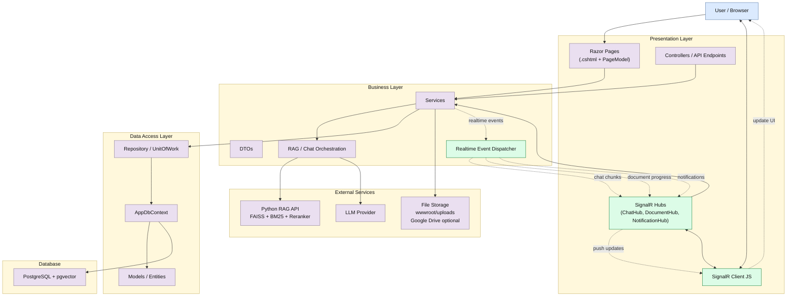

# SignalR 3-Layer Architecture

## What Changed From The Old Diagram

- The architecture still keeps the same 3 layers: Presentation, Business, and Data Access.
- The Presentation Layer changes from MVC-only UI to Razor Pages plus SignalR.
- SignalR Hubs stay in the Presentation Layer because they are ASP.NET endpoints.
- Business services remain the place for chat, document, admin, and permission logic.
- Realtime events are emitted from the Business Layer and pushed to the browser through SignalR Hubs.

## Realtime Features Added

- Realtime chat response updates.
- AI answer chunk streaming.
- Document processing progress.
- Admin approval and permission notifications.
- Auto-update chat session and document sidebars.
