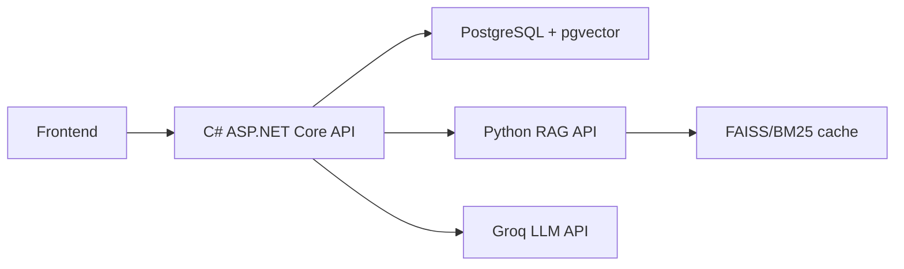
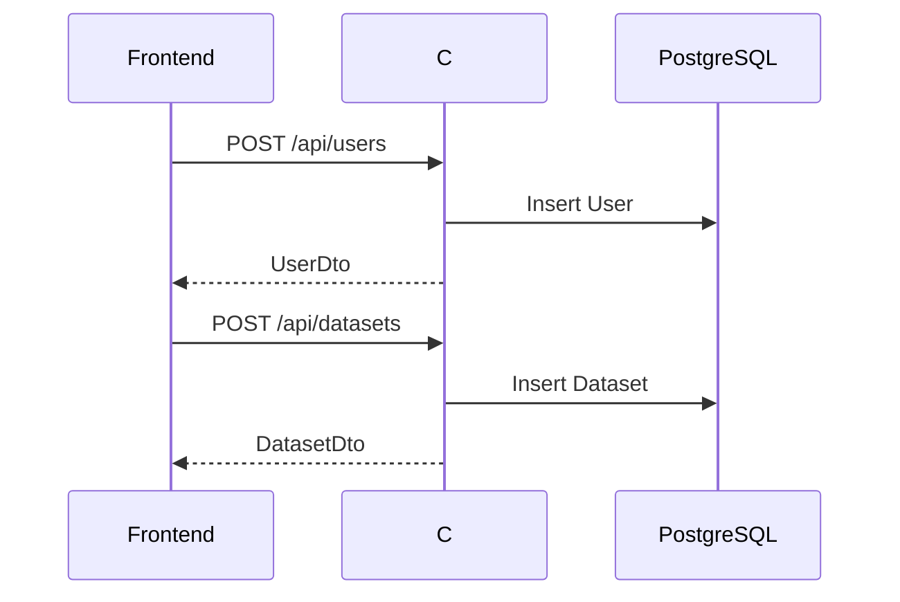
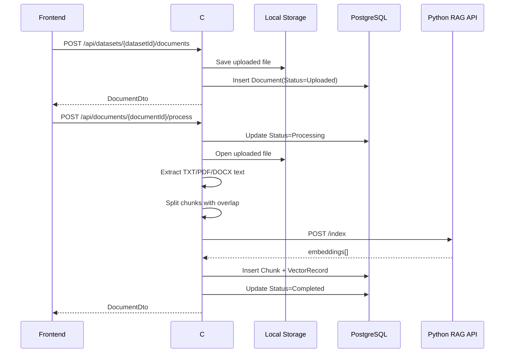
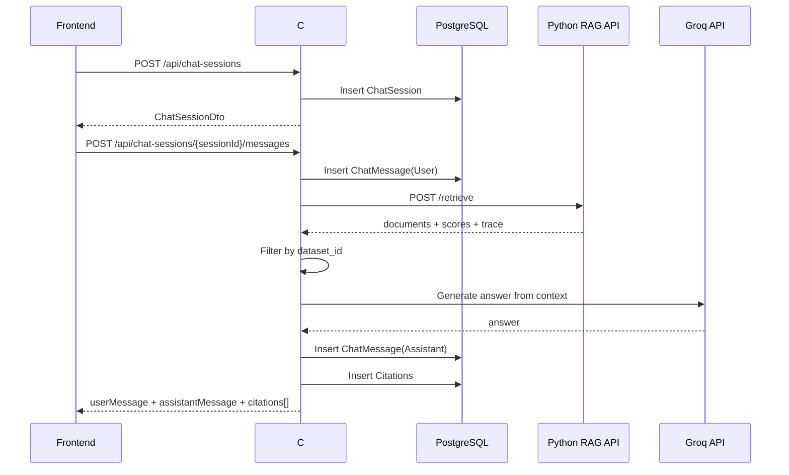

# Báo Cáo Triển Khai TV1 - RAG Chatbot System

## 1. Mục Tiêu

Tài liệu này tổng hợp các phần TV1 đã thực hiện trong dự án RAG Chatbot System: tích hợp luồng Business Logic chính giữa C# Web App, PostgreSQL/pgvector, Python RAG API và LLM API.

Phạm vi thực hiện tập trung vào C# solution:

- Xử lý tài liệu đã upload thông qua API process riêng.
- Trích xuất nội dung từ `.txt`, `.pdf`, `.docx`.
- Chia văn bản thành chunk có overlap để cải thiện chất lượng ngữ cảnh cho LLM.
- Gọi Python RAG API để index và retrieve.
- Lưu `Chunk`, `VectorRecord`, `ChatMessage`, `Citation`.
- Trả citations ngay trong response của API chat.
- Viết unit tests cho các phần xử lý quan trọng.

Không sửa folder `RAG-Retrieval-Indexing-API` vì contract hiện tại đã đáp ứng đủ luồng cần tích hợp.

## 2. Kiến Trúc Hiện Tại

Dự án C# đang theo mô hình 3-layer:

```text
RagChatbotSystem.Presentation
-> Controllers, API endpoints, DI setup, local file storage.

RagChatbotSystem.Business
-> Services, DTOs, business orchestration, RAG/LLM clients.

RagChatbotSystem.DataAccess
-> EF Core DbContext, entity models, migrations, PostgreSQL/pgvector.
```

Python RAG API là service riêng:

```text
RAG-Retrieval-Indexing-API
-> FastAPI
-> /index
-> /retrieve
-> /documents/{document_id}
-> FAISS + BM25 + CrossEncoder rerank
```

Tổng thể luồng hệ thống:



## 3. Tính Năng Đã Implement

### 3.1 Upload Riêng Và Process Riêng

Upload file và process/index file được tách thành hai bước riêng biệt để frontend có thể hiển thị nút `Process`.

Endpoint upload đã có:

```http
POST /api/datasets/{datasetId}/documents
Content-Type: multipart/form-data
```

Body:

```text
uploadedBy=<userId>
file=<.txt/.pdf/.docx>
```

Kết quả:

- Lưu file vào `wwwroot/uploads/datasets/{datasetId}`.
- Tạo bản ghi `Document`.
- Set `Document.Status = Uploaded`.

Endpoint process mới:

```http
POST /api/documents/{documentId}/process
```

Kết quả:

- Đọc lại file đã upload.
- Trích xuất text.
- Chia text thành chunk có overlap.
- Gọi Python `/index`.
- Lưu `Chunks` và `VectorRecords`.
- Set status `Completed` nếu thành công.
- Set status `Failed` nếu trích xuất hoặc index lỗi.

File liên quan:

- `RagChatbotSystem.Presentation/Controllers/DocumentsController.cs`
- `RagChatbotSystem.Business/Services/DocumentService.cs`
- `RagChatbotSystem.Presentation/Services/LocalFileStorageService.cs`

### 3.2 Hỗ Trợ TXT/PDF/DOCX

C# Business layer đã thêm extractor cho:

- `.txt`: đọc text trực tiếp bằng UTF-8.
- `.pdf`: đọc text theo từng page bằng `UglyToad.PdfPig`.
- `.docx`: đọc text bằng `DocumentFormat.OpenXml`.

Không hỗ trợ OCR. Nếu PDF là file scan/ảnh và không trích xuất được text, service trả lỗi:

```text
No extractable text found.
```

Đồng thời document được update:

```text
Status = Failed
```

### 3.3 Chunking Có Overlap

Chunking hiện dùng:

```text
chunkSize = 600
chunkOverlap = 120
```

Mục tiêu:

- Giữ ngữ cảnh liên tục giữa các chunk.
- Bảo vệ chất lượng retrieval.
- Giảm nguy cơ LLM mất thông tin do câu hoặc đoạn văn bị cắt giữa chừng.

Với PDF, chunk có thể vượt qua ranh giới page để ưu tiên chất lượng câu trả lời. Khi chunk chứa nội dung từ nhiều page:

```text
pageNumber = page có nhiều ký tự nhất trong chunk
```

Đây là quy ước đã được thống nhất.

### 3.4 Metadata Gửi Sang Python RAG API

Khi C# gọi Python `/index`, mỗi chunk được gửi theo schema:

```json
{
  "page_content": "full chunk content",
  "metadata": {
    "id": "chunk-guid",
    "document_id": "document-guid",
    "dataset_id": "dataset-guid",
    "file_name": "sample.pdf",
    "page_number": 2,
    "chunk_index": 4
  }
}
```

Python API không đọc file trực tiếp. Python chỉ nhận text chunks qua `page_content`.

### 3.5 Lưu Chunk Và VectorRecord

Sau khi Python `/index` trả embeddings:

- C# kiểm tra số lượng embeddings phải bằng số lượng chunks.
- Nếu không khớp, process fail.
- Nếu khớp, C# lưu:
  - `Chunks`
  - `VectorRecords`

`VectorRecord.Embedding` dùng pgvector `vector(384)`, phù hợp với model:

```text
sentence-transformers/all-MiniLM-L6-v2
```

### 3.6 Chat API Trả Citation Ngay

Endpoint chat mới:

```http
POST /api/chat-sessions/{sessionId}/messages
Content-Type: application/json
```

Request:

```json
{
  "question": "Nội dung chính của tài liệu là gì?"
}
```

Response:

```json
{
  "userMessage": {
    "messageId": "...",
    "sessionId": "...",
    "role": "User",
    "content": "...",
    "createdAt": "..."
  },
  "assistantMessage": {
    "messageId": "...",
    "sessionId": "...",
    "role": "Assistant",
    "content": "...",
    "createdAt": "..."
  },
  "citations": [
    {
      "citationId": "...",
      "messageId": "...",
      "documentId": "...",
      "chunkId": "...",
      "pageNumber": 1,
      "quoteText": "full chunk content",
      "sourceLabel": "sample.pdf",
      "createdAt": "..."
    }
  ]
}
```

Lưu ý:

- `quoteText` là toàn bộ chunk.
- Backend không trả field preview.
- `sourceLabel` ưu tiên `file_name` từ metadata.
- `pageNumber` lấy từ metadata `page_number`.

File liên quan:

- `RagChatbotSystem.Presentation/Controllers/ChatSessionsController.cs`
- `RagChatbotSystem.Business/Services/ChatService.cs`
- `RagChatbotSystem.Business/DTOs/ChatDtos.cs`

### 3.7 Python API Error Handling

`RagApiClient` đã được cải thiện:

- `/index` lỗi sẽ throw exception có endpoint/status/body.
- `/retrieve` lỗi sẽ throw exception có endpoint/status/body.
- Không còn im lặng trả DTO rỗng cho các luồng quan trọng.

Điều này giúp debug đúng lỗi:

- Python API down.
- Response schema sai.
- Index/retrieve lỗi server.

## 4. API Flow Chi Tiết

### 4.1 Setup Knowledge Base



### 4.2 Upload Và Process Document



Nếu lỗi:

```text
Status = Failed
```

File không bị xóa để user có thể retry.

### 4.3 Chat Và Citation



## 5. API Contract Hiện Tại

### 5.1 Users

```http
GET /api/users
GET /api/users/{userId}
POST /api/users
```

Create user:

```json
{
  "fullName": "Test User",
  "email": "test@example.com",
  "role": "User"
}
```

### 5.2 Datasets

```http
GET /api/datasets
GET /api/datasets/{datasetId}
POST /api/datasets
DELETE /api/datasets/{datasetId}
```

Create dataset:

```json
{
  "name": "Demo Dataset",
  "description": "Test RAG",
  "createdBy": "USER_ID"
}
```

### 5.3 Documents

```http
GET /api/datasets/{datasetId}/documents
GET /api/documents/{documentId}
POST /api/datasets/{datasetId}/documents
POST /api/documents/{documentId}/process
DELETE /api/documents/{documentId}
```

Upload:

```powershell
curl.exe -X POST http://localhost:5259/api/datasets/DATASET_ID/documents `
  -F "uploadedBy=USER_ID" `
  -F "file=@D:\path\sample.pdf"
```

Process:

```powershell
curl.exe -X POST http://localhost:5259/api/documents/DOCUMENT_ID/process
```

### 5.4 Chat Sessions

```http
GET /api/chat-sessions/{sessionId}
POST /api/chat-sessions
GET /api/chat-sessions/{sessionId}/messages
POST /api/chat-sessions/{sessionId}/messages
```

Create session:

```json
{
  "userId": "USER_ID",
  "datasetId": "DATASET_ID",
  "title": "Test Chat"
}
```

Send message:

```json
{
  "question": "Nội dung chính của tài liệu là gì?"
}
```

## 6. Config Cần Thiết

File local:

```text
RagChatbotSystem.Presentation/appsettings.json
```

File này đang được `.gitignore` ignore, không nên commit vì có secret.

Config cần có:

```json
{
  "ConnectionStrings": {
    "DefaultConnection": "Host=localhost;Port=5432;Database=rag_chatbot;Username=postgres;Password=12345"
  },
  "RagApi": {
    "BaseUrl": "http://127.0.0.1:8000"
  },
  "Groq": {
    "ApiKey": "DO_NOT_COMMIT_REAL_KEY",
    "Model": "llama-3.3-70b-versatile"
  }
}
```

Khuyến nghị bảo mật:

- Không commit API key.
- Nếu key đã từng bị push lên remote, cần rotate key.
- Nên dùng environment variable hoặc user-secrets.

Ví dụ environment variables:

```powershell
$env:ConnectionStrings__DefaultConnection="Host=localhost;Port=5432;Database=rag_chatbot;Username=postgres;Password=12345"
$env:RagApi__BaseUrl="http://127.0.0.1:8000"
$env:Groq__ApiKey="YOUR_KEY"
```

## 7. Yêu Cầu Môi Trường

### 7.1 PostgreSQL + pgvector

Migration yêu cầu extension:

```sql
CREATE EXTENSION IF NOT EXISTS vector;
```

PostgreSQL local hiện tại có thể connect được bằng password `12345`, nhưng nếu server chưa cài pgvector thì migration sẽ fail:

```text
extension "vector" is not available
```

Cách nhanh nhất là dùng Docker:

```powershell
docker run --name rag-pgvector `
  -e POSTGRES_PASSWORD=12345 `
  -e POSTGRES_DB=rag_chatbot `
  -p 5433:5432 `
  -d pgvector/pgvector:pg16
```

Nếu dùng container trên, connection string cần đổi port:

```json
"DefaultConnection": "Host=localhost;Port=5433;Database=rag_chatbot;Username=postgres;Password=12345"
```

Chạy migration:

```powershell
dotnet ef database update --project RagChatbotSystem.DataAccess --startup-project RagChatbotSystem.Presentation
```

### 7.2 Python RAG API

Chạy Python API:

```powershell
cd RAG-Retrieval-Indexing-API\RAG-Retrieval-Indexing-API
uv run uvicorn main:app --host 127.0.0.1 --port 8000
```

Health check:

```powershell
curl.exe http://127.0.0.1:8000/health
```

Lần đầu chạy có thể lâu vì cần tải dependencies/model.

### 7.3 C# App

Chạy C#:

```powershell
dotnet run --project RagChatbotSystem.Presentation\RagChatbotSystem.Presentation.csproj --launch-profile http
```

URL:

```text
http://localhost:5259
```

## 8. Test Plan

### 8.1 Automated Tests

Đã thêm test project:

```text
RagChatbotSystem.Tests
```

Test hiện có:

- Chunk overlap.
- Dominant PDF page number khi chunk đi qua nhiều page.
- Extract `.txt`.
- Extract `.docx`.
- Reject unsupported file type.

Chạy test:

```powershell
dotnet test RagChatbotSystem.sln
```

Kết quả gần nhất:

```text
Passed: 5/5
```

### 8.2 Manual End-To-End Test

1. Start Python RAG API.
2. Start PostgreSQL có pgvector.
3. Run EF migration.
4. Start C# app.
5. Tạo user.
6. Tạo dataset.
7. Upload file `.txt`, `.pdf`, hoặc `.docx`.
8. Gọi process API.
9. Tạo chat session.
10. Gửi câu hỏi.
11. Kiểm tra response có answer và citations.

Expected citation:

```json
{
  "pageNumber": 1,
  "quoteText": "full chunk content"
}
```

Với PDF, `pageNumber` phải phản ánh page có nhiều nội dung nhất trong chunk.

## 9. Những File Đã Thay Đổi/Thêm

### Business

- `RagChatbotSystem.Business/DTOs/ChatDtos.cs`
- `RagChatbotSystem.Business/Interfaces/IChatService.cs`
- `RagChatbotSystem.Business/Interfaces/IDocumentService.cs`
- `RagChatbotSystem.Business/Interfaces/IFileStorageService.cs`
- `RagChatbotSystem.Business/RagChatbotSystem.Business.csproj`
- `RagChatbotSystem.Business/Services/ChatService.cs`
- `RagChatbotSystem.Business/Services/DocumentService.cs`
- `RagChatbotSystem.Business/Services/RagApiClient.cs`
- `RagChatbotSystem.Business/Properties/AssemblyInfo.cs`

### Presentation

- `RagChatbotSystem.Presentation/Controllers/ChatSessionsController.cs`
- `RagChatbotSystem.Presentation/Controllers/DocumentsController.cs`
- `RagChatbotSystem.Presentation/Controllers/TestRagController.cs`
- `RagChatbotSystem.Presentation/Services/LocalFileStorageService.cs`
- `RagChatbotSystem.Presentation/appsettings.json` local only, ignored by git.

### Tests

- `RagChatbotSystem.Tests/RagChatbotSystem.Tests.csproj`
- `RagChatbotSystem.Tests/DocumentProcessingTests.cs`
- `RagChatbotSystem.sln`

## 10. Các Lưu Ý Còn Lại

### 10.1 Pgvector Là Blocker Bắt Buộc

Không có pgvector thì migration không chạy được vì DB có column:

```text
VectorRecord.Embedding -> vector(384)
```

Cần cài pgvector vào PostgreSQL local hoặc dùng Docker image `pgvector/pgvector`.

### 10.2 Appsettings Có Secret

`appsettings.json` đang bị `.gitignore` ignore. Không nên commit file này.

Nếu cần chia config cho team, tạo file mẫu riêng không chứa secret, ví dụ:

```text
appsettings.example.json
```

### 10.3 Python API Là Stateful Service

Python RAG API dùng cache:

```text
cache/faiss_index
cache/bm25.pkl
```

Do đó khi test lại nhiều lần, cần để ý `rebuild_cache` và cache cũ.

Hiện C# process document gửi `rebuild_cache = false`, nghĩa là thêm document vào index hiện có. Nếu muốn reset knowledge base khi test, cần xóa Python cache hoặc gọi endpoint delete/reset riêng nếu TV3 bổ sung.

### 10.4 Retrieve Chưa Filter Dataset Từ Python

Python `/retrieve` hiện chưa nhận `dataset_id`. C# đang retrieve top candidates rồi filter theo metadata `dataset_id`.

Trong tương lai nên để TV3 bổ sung:

```json
{
  "query": "...",
  "dataset_id": "...",
  "top_k": 10
}
```

Để tránh retrieve nhầm dataset khi index lớn.

## 11. Kết Luận

Phần TV1 đã có đủ các thành phần chính để vận hành flow RAG:

```text
Upload -> Process -> Extract -> Chunk -> Index -> Chat -> Retrieve -> LLM -> Citation
```

Điều kiện còn lại để test end-to-end thành công là môi trường:

- PostgreSQL có pgvector.
- Python RAG API running.
- Groq API key hợp lệ.
- Migration đã apply.

Sau khi các điều kiện này sẵn sàng, frontend có thể tích hợp trực tiếp với các endpoint đã nêu ở trên.
