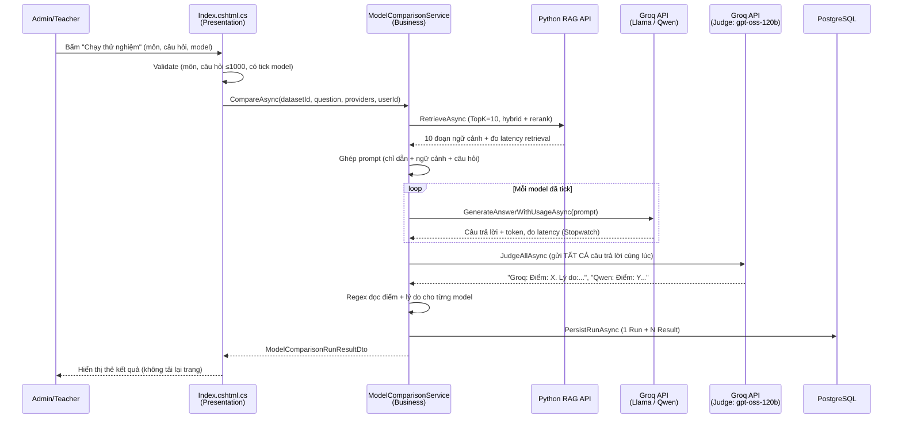
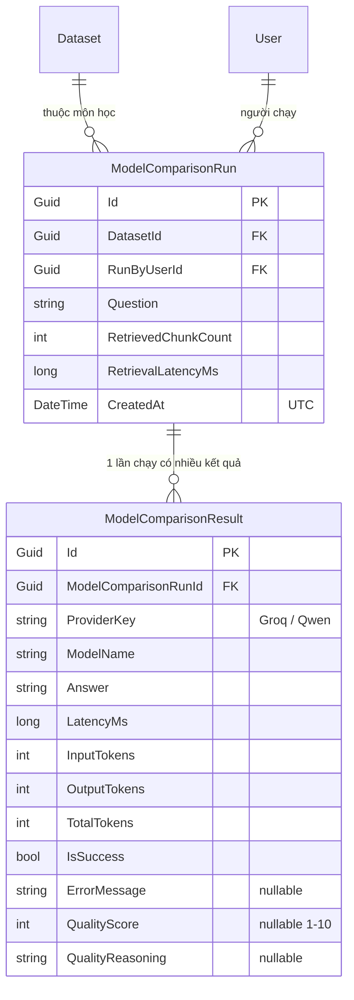

# So sánh mô hình AI — Luồng xử lý & Mô hình dữ liệu

Tài liệu này mô tả **chi tiết luồng chạy** (từ lúc bấm nút tới lúc lưu DB), **mô hình dữ liệu**, và **các quyết định thiết kế** của tính năng.

## 1. Luồng xử lý một lần "Chạy thử nghiệm"

**Điểm mấu chốt về công bằng**: bước Retrieval chạy **đúng 1 lần**, ngữ cảnh dùng chung cho **tất cả** model và cho **cả giám khảo** — không model nào có lợi thế ngữ cảnh khác nhau.

## 2. Mô hình dữ liệu

- Quan hệ khóa ngoại (cấu hình trong `AppDbContext.OnModelCreating`):
  - `Run → Dataset`: **Cascade** (xoá dataset thì xoá luôn lịch sử của nó).
  - `Run → User`: **Restrict** (không cho xoá user còn lịch sử).
  - `Result → Run`: **Cascade** (xoá lần chạy thì xoá kết quả con).
- Migration: `20260713115220_AddModelComparisonHistory`.
- `CreatedAt` lưu theo **UTC**; khi hiển thị mới quy đổi sang giờ Việt Nam bằng `FormatVietnamTime` (vì container chạy giờ UTC, `ToLocalTime()` không quy đổi đúng).

## 3. Chấm điểm bằng LLM-as-judge

### Vì sao dùng giám khảo AI, không dùng thuật toán?
Để tránh việc người dùng phải tự đọc và đánh giá bằng mắt (chậm, chủ quan giữa các người). Đây là phương pháp được ngành công nhận (MT-Bench, AlpacaEval... đều dùng LLM-as-judge).

### Vì sao chọn model giám khảo KHÁC?
Nếu để Groq/Qwen tự chấm câu trả lời của chính nó → thiên vị (self-preference bias). Nên giám khảo dùng `openai/gpt-oss-120b` — khác dòng huấn luyện với cả Llama và Qwen.

### Vì sao chấm SO SÁNH thay vì từng câu?
Ban đầu chấm từng câu độc lập → 2 câu trả lời dài/ngắn khác hẳn nhau vẫn ra điểm bằng nhau (giám khảo không có gì để so sánh). Nay gửi **tất cả câu trả lời cùng lúc** trong 1 prompt, yêu cầu giám khảo **so sánh trực tiếp và phân biệt** — điểm số phân hoá rõ hơn.

### An toàn khi lỗi
- Nếu giám khảo lỗi hoặc trả về sai định dạng (regex không đọc được điểm) → `QualityScore` để trống (`null`), **không** làm sập lần so sánh. Câu trả lời vẫn hiển thị.
- Điểm luôn bị ép về khoảng 1–10 (`Math.Clamp`).

## 4. Phân quyền dữ liệu (`ScopeRunsByRole`)

| Vai trò | Thấy lịch sử/biểu đồ của |
|---|---|
| Admin | Tất cả các lần chạy |
| Teacher | Chỉ các môn được phân công (`Dataset.TeacherSubjectAssignment.TeacherId == userId`) |
| Khác | Không có (trả về rỗng) |

## 5. Xử lý đặc thù từng model

- **Qwen** là "reasoning model" — trả về cả block suy luận `<think>...</think>` lẫn trong nội dung. `GroqService.StripReasoning` dùng regex bỏ block này trước khi hiển thị. Model không có `<think>` (Llama) không bị ảnh hưởng.

## 6. Thống kê cho biểu đồ (`GetStatsAsync`)

Gom nhóm theo `ProviderKey`, tính trên các bản ghi **thành công**:
- Token trung bình (`AvgTotalTokens`) — chi phí.
- Độ trễ trung bình (`AvgLatencyMs`) — tốc độ.
- Điểm chất lượng trung bình (`AvgQualityScore`) — do AI chấm.

Lần lỗi bị loại khỏi phép tính trung bình để không làm sai lệch số liệu.

## 7. Hướng mở rộng (chưa làm — ghi nhận để tham khảo)

- Thêm chỉ số khách quan theo chuẩn **RAGAS** cho hệ RAG: **Faithfulness** (độ bám tài liệu) và **Answer Relevance** (độ liên quan), tính bằng cosine similarity trên embedding. Building block đã có sẵn trong Python RAG API (model embedding đã load, đã normalize) — chỉ cần thêm 1 endpoint `/score`. Việc này giúp benchmark có chỉ số khách quan, lặp lại được, bổ trợ cho điểm AI chấm.
