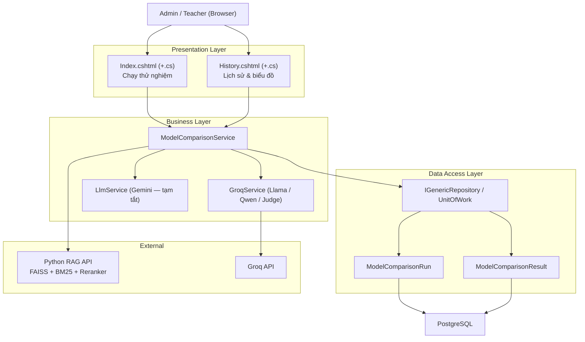

# So sánh mô hình AI (Model Comparison) — Kiến trúc & Cấu hình

## Mục tiêu

Cho phép **Admin/Teacher** chạy cùng một câu hỏi qua nhiều model AI khác nhau trên **cùng một ngữ cảnh truy xuất (retrieval)**, để so sánh khách quan: chất lượng câu trả lời, thời gian phản hồi và số token (chi phí). Kết quả được **lưu vào database** và tổng hợp thành **biểu đồ** phục vụ báo cáo/benchmark.

Đây là công cụ **nội bộ** cho Admin/Teacher — tách biệt hoàn toàn khỏi luồng chat mà sinh viên sử dụng, và **không** trừ Credit của bất kỳ ai.

## Các model đang dùng

| Provider (key nội bộ) | Model thật | Cách gọi | Ghi chú |
|---|---|---|---|
| `Groq` | `llama-3.3-70b-versatile` | Groq API (miễn phí) | Meta / Llama |
| `Qwen` | `qwen/qwen3-32b` | Groq API (miễn phí) | Alibaba / Qwen — gọi qua **chính hạ tầng Groq** |
| `Gemini` | `gemini-3.1-flash-lite` | Google API (yêu cầu GEMINI_API_KEY) | Google Gemini |

- Giám khảo (LLM-as-judge): `openai/gpt-oss-120b`, cũng gọi qua Groq — chọn model **khác dòng huấn luyện** với các model được so sánh để tránh thiên vị tự chấm.
- Hằng số model được khai báo ở đầu `ModelComparisonService.cs`: `JudgeModel`, `QwenModel`.

### Đổi/bật lại provider
- **Đổi model Qwen**: sửa hằng số `QwenModel` trong `ModelComparisonService.cs`.
- **Đổi model giám khảo**: sửa hằng số `JudgeModel` (không chọn trùng model đang được so sánh).
- **Bật lại Gemini**: bỏ comment các dòng `Gemini` ở 3 chỗ — `AvailableProviders` + `CreateProvider` (trong `ModelComparisonService.cs`) và `ProviderLabel` (trong `Index.cshtml` + `History.cshtml`). Điều kiện: `.env` phải có `GEMINI_API_KEY` còn quota.

## Kiến trúc 3 lớp

**Quy tắc 3 lớp**: Presentation chỉ gọi xuống Business (qua `IModelComparisonService`); Business gọi xuống DataAccess (qua `IGenericRepository<T>`). Presentation **không** tham chiếu trực tiếp DataAccess.

## Các thành phần chính (theo lớp)

### Presentation
- `Pages/Admin/ModelComparison/Index.cshtml` (+`.cs`): trang chạy thử nghiệm. `[Authorize(Roles = "Admin,Teacher")]`. Nhận form, gọi `CompareAsync`, hiển thị thẻ kết quả.
- `Pages/Admin/ModelComparison/History.cshtml` (+`.cs`): trang lịch sử + 3 biểu đồ (Chart.js). Có hàm `FormatVietnamTime` quy đổi giờ UTC → giờ Việt Nam.

### Business
- `Services/ModelComparisonService.cs`: điều phối toàn bộ — retrieval, gọi từng provider, chấm điểm so sánh (`JudgeAllAsync`), lưu DB (`PersistRunAsync`), truy vấn lịch sử/thống kê (`GetHistoryAsync`, `GetStatsAsync`), lọc theo vai trò (`ScopeRunsByRole`).
- `Services/GroqService.cs`: gọi Groq API. Có tham số tùy chọn `modelOverride` → 1 class dùng được cho nhiều model. Có `StripReasoning` để bỏ block `<think>...</think>` của model Qwen.
- `Services/LlmService.cs`: gọi Gemini (giữ nguyên, tạm không dùng).
- DTOs: `ModelComparisonResultDto`, `ModelComparisonRunResultDto`, `ModelComparisonRunSummaryDto`, `ModelComparisonStatsDto` (+ `ModelComparisonProviderStatDto`).

### Data Access
- `Models/ModelComparisonRun.cs`: 1 lần chạy (câu hỏi, dataset, người chạy, số chunk, latency retrieval, thời điểm). Quan hệ 1–nhiều với `Results`.
- `Models/ModelComparisonResult.cs`: kết quả 1 model trong 1 lần chạy (câu trả lời, latency, token, trạng thái, `QualityScore`, `QualityReasoning`).
- Migration: `20260713115220_AddModelComparisonHistory` — tạo 2 bảng + index + khóa ngoại (Run→Dataset Cascade, Run→User Restrict, Result→Run Cascade).

## Named HttpClient (Program.cs)

Các client `ModelComparison.*` được đăng ký **riêng**, tách khỏi HttpClient dùng cho `ChatService`, để timeout và base address độc lập với luồng chat chính:

- `ModelComparison.Groq` — base `https://api.groq.com/openai/v1/`, gắn sẵn header `Authorization: Bearer <GROQ_API_KEY>`. Dùng cho cả Llama, Qwen và giám khảo (chỉ khác tên model trong payload).
- `ModelComparison.Gemini` — dùng khi bật lại Gemini.

`ModelComparisonService` tạo `HttpClient` theo tên qua `IHttpClientFactory` rồi `new` trực tiếp concrete class (`GroqService`/`LlmService`) — cách này tách biệt hoàn toàn khỏi DI của `ChatService`, không ảnh hưởng luồng chat sản xuất.

## Cấu hình cần có (`.env`)

- `GROQ_API_KEY` — **bắt buộc** (dùng cho Llama, Qwen và giám khảo).
- `GEMINI_API_KEY` — chỉ cần khi bật lại Gemini.
- Không cần key riêng cho Qwen hay giám khảo (dùng chung `GROQ_API_KEY`).
